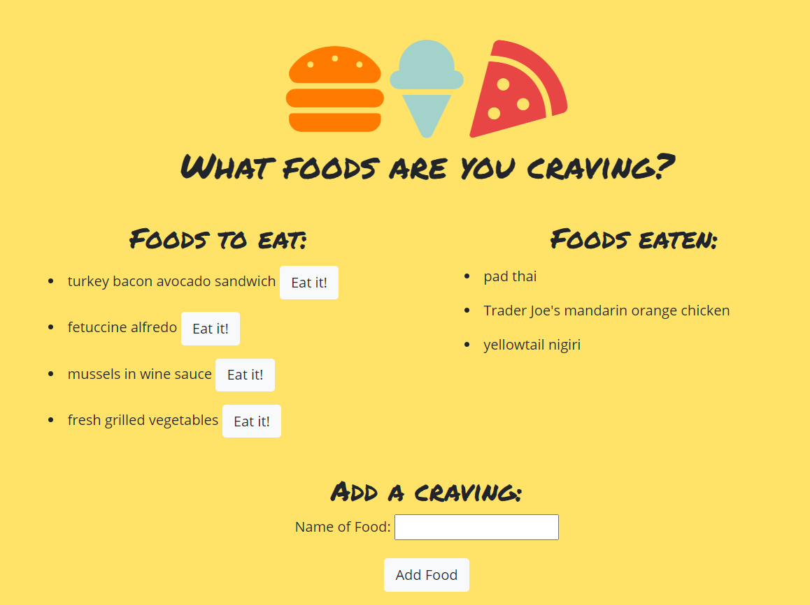

# Burger

## Summary 
This full-stack application accepts user input, displays the input on the page, and stores the input in the MySQL database. Each food entered can then be "eaten" by pressing the button next to each food name. This sets the corresponding value of the "devoured" column in the database from false to true, then moves the burger name to the "Burgers eaten" side of the page.

This app uses Express and Node to set up and communicate with a web server, Handlebars as an HTML generation engine, and a MySQL database.

## Installation
To download this code to your own machine, enter the following in your command line:

`git clone https://github.com/EmilyAH-01/cravings`

Previous installation of Node.js and MySQL are required to run this program locally. To set up the database, first run schema.sql in MySQL Workbench, then seeds.sql to populate the table. In the command line, enter: 

`npm install`

## Usage
Navigate into your cloned project directory. In command line, enter: 

`npm start`

## Deployed Application
https://emilyh-cravings.herokuapp.com/

## Credit
The starter code for this application was provided by MSU Coding Bootcamp. 

